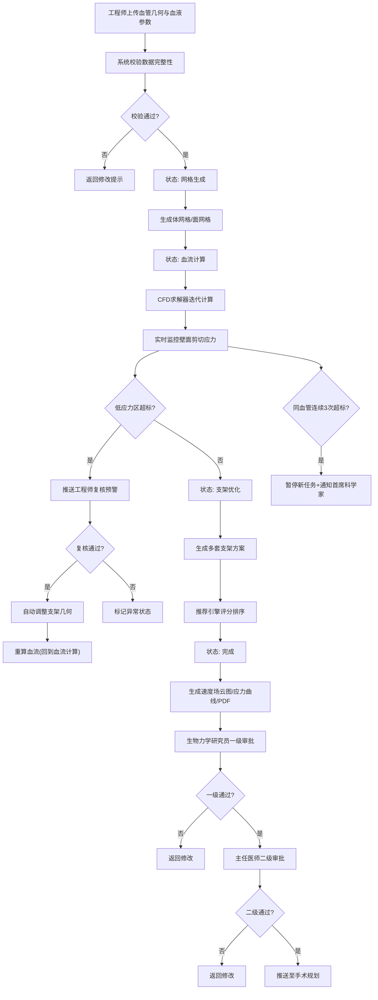

## 1. 产品概述
心血管血流动力学模拟与支架优化平台，面向心血管外科医生、生物力学研究员和临床工程师，提供从血管几何上传、血流模拟计算到支架方案优化的全流程数字化解决方案。
- 解决传统支架植入依赖经验、缺乏量化评估的问题，通过计算流体力学(CFD)模拟实现个性化支架方案优化
- 目标市场价值：提升心血管介入手术成功率，降低术后再狭窄风险，为精准医疗提供技术支撑

## 2. 核心功能

### 2.1 用户角色
| 角色 | 注册方式 | 核心权限 |
|------|----------|----------|
| 临床工程师 | 系统创建 | 上传病例、发起模拟任务、复核预警、调整支架参数 |
| 生物力学研究员 | 系统创建 | 一级审批模拟结果、查看技术细节、参与异常分析 |
| 主任医师/医生 | 系统创建 | 二级审批支架方案、推送至手术规划、查看统计看板 |
| 首席科学家 | 系统创建 | 接收异常通知、管理暂停任务、全局权限 |

### 2.2 功能模块
1. **数据看板页面**: 全局统计、今日任务、异常告警、效率指标
2. **任务管理页面**: 任务列表、上传入口、状态筛选、任务详情
3. **模拟监控页面**: 实时状态流转、应力监控、计算进度、预警列表
4. **报告查看页面**: 速度场云图、应力曲线、支架方案对比、PDF导出
5. **审批中心页面**: 待审批列表、一级/二级审批、审批历史、手术规划推送
6. **病例档案页面**: 血管数据管理、血液参数配置、历史记录

### 2.3 页面详情
| 页面名称 | 模块名称 | 功能描述 |
|-----------|-------------|---------------------|
| 数据看板 | 统计卡片组 | 完成率、平均应力、优化次数、今日任务数实时展示 |
| 数据看板 | 趋势图表 | 近7日完成率曲线、应力分布柱状图 |
| 数据看板 | 异常告警区 | 连续三次低应力超标预警、实时滚动提醒 |
| 任务管理 | 任务列表 | 状态标签、进度条、血管缩略图、操作按钮 |
| 任务管理 | 新建任务 | 上传血管STL/OBJ、配置血液参数(粘度、密度、流速)、校验 |
| 模拟监控 | 状态流转图 | 六态流转可视化、当前状态高亮、耗时统计 |
| 模拟监控 | 实时监控面板 | 壁面剪切应力热力图、阈值线、区域超标标记 |
| 模拟监控 | 预警处理 | 低应力预警推送、工程师复核、自动调整触发 |
| 报告查看 | 速度场云图 | 2D切面云图、向量场、图例与颜色映射 |
| 报告查看 | 应力曲线 | 时间-应力曲线、多方案对比、阈值参考线 |
| 报告查看 | 支架方案推荐 | 推荐引擎Top3方案、评分与参数对比 |
| 报告查看 | PDF导出 | 一键生成完整报告(含图表与方案) |
| 审批中心 | 审批列表 | 分级待办、病例摘要、审批操作 |
| 审批中心 | 审批历史 | 审批轨迹、意见记录、操作人时间戳 |
| 病例档案 | 血管数据管理 | 三维模型预览、参数编辑、版本管理 |

## 3. 核心流程
用户上传血管三维几何模型与血液参数后，系统自动校验数据完整性并启动网格化处理。任务依次经过网格生成、血流计算、支架优化三个计算阶段，期间实时监控壁面剪切应力分布，若检测到低于阈值区域则推送工程师复核，复核通过后系统自动调整支架几何参数并重算。模拟完成后生成速度场云图、应力曲线与多套支架方案，由推荐引擎评分排序后提交生物力学研究员一级审批、主任医师二级审批，审批通过则推送至手术规划系统。同一条血管连续三次出现低应力区超标时，系统自动暂停该血管新任务并通知首席科学家介入。

## 4. 用户界面设计

### 4.1 设计风格
- 主色调: 深空蓝(#0B1929) 搭配 医学青(#00D4AA)，辅助色: 警示橙(#FF7A45)、危险红(#FF4D6A)
- 按钮风格: 圆角8px，主按钮医学青渐变，悬停微上浮+发光效果
- 字体: 标题使用"Space Grotesk"粗体，正文使用"Inter"常规，数据数字使用"JetBrains Mono"等宽
- 布局风格: 左侧导航+右侧内容区，卡片式信息分组，大量数据可视化组件
- 图标风格: Lucide线性图标，数据指标使用发光数字卡片

### 4.2 页面设计概述
| 页面名称 | 模块名称 | UI元素 |
|-----------|-------------|-------------|
| 数据看板 | 统计卡片组 | 深色玻璃拟态卡片、发光数字、微渐变背景、悬停微动效 |
| 数据看板 | 趋势图表 | ECharts折线+柱状组合图、医学青主色、平滑曲线动画 |
| 模拟监控 | 状态流转图 | 六节点垂直流程图、当前态发光脉冲、连接线渐变 |
| 模拟监控 | 实时监控面板 | 伪彩色热力图(蓝-青-黄-橙-红)、实时刷新动画 |
| 报告查看 | 速度场云图 | Canvas渲染伪彩色场、可交互切面选择、向量箭头叠加 |
| 审批中心 | 审批列表 | 行级审批操作、状态徽章、审批进度条 |

### 4.3 响应式
- 桌面端优先(1440px基准)，适配1920px大屏
- 平板端(1024px)导航折叠为图标栏
- 移动端(768px)采用底部Tab导航，图表单列堆叠

### 4.4 可视化场景设计
- 速度场云图: 使用医学影像风格的蓝青红黄伪彩色谱，叠加速度向量箭头，支持鼠标悬停查看数值
- 应力曲线: 多方案叠加对比，实时数据点动态更新，阈值线虚线警示
- 状态流转: 节点发光脉冲表示当前阶段，完成节点打勾，异常节点红色闪烁
