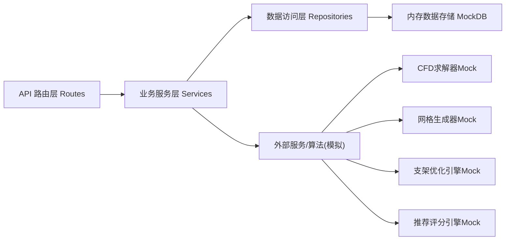
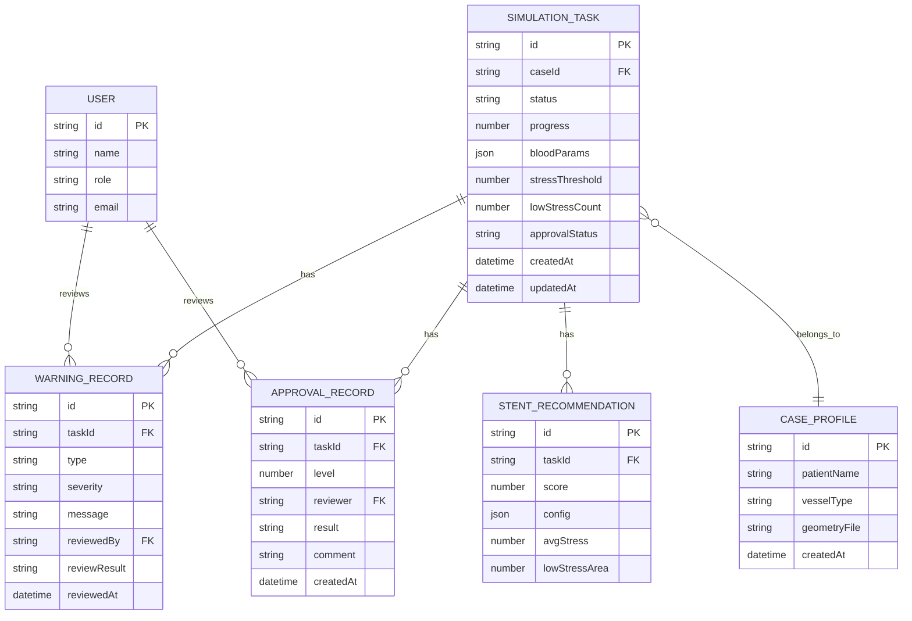

## 1. 架构设计

```mermaid
graph TD
    subgraph "前端展示层"
        A["React 18 单页应用"]
        A1["数据看板 Dashboard"]
        A2["任务管理 TaskManager"]
        A3["模拟监控 SimulationMonitor"]
        A4["报告查看 ReportViewer"]
        A5["审批中心 ApprovalCenter"]
        A6["病例档案 CaseArchive"]
    end
    subgraph "状态管理层"
        B["Zustand 全局状态"]
        B1["任务状态 Store"]
        B2["用户会话 Store"]
        B3["预警通知 Store"]
    end
    subgraph "后端服务层"
        C["Express API 服务"]
        C1["任务管理 API"]
        C2["模拟计算 API(模拟)"]
        C3["审批流程 API"]
        C4["推荐引擎 API"]
        C5["统计报表 API"]
        C6["文件导出 API"]
    end
    subgraph "数据存储层"
        D["内存数据 + Mock"]
        D1["任务数据"]
        D2["用户数据"]
        D3["病例档案"]
        D4["审批记录"]
        D5["统计数据"]
    end
    subgraph "可视化层"
        E["ECharts 图表库"]
        E1["趋势统计图"]
        E2["应力曲线图"]
        E3["状态流转图"]
        F["Canvas 自定义渲染"]
        F1["速度场云图"]
        F2["壁面应力热力图"]
    end
    A --> A1 & A2 & A3 & A4 & A5 & A6
    A1 & A2 & A3 & A4 & A5 & A6 --> B
    B --> B1 & B2 & B3
    A --> C
    C --> C1 & C2 & C3 & C4 & C5 & C6
    C --> D
    D --> D1 & D2 & D3 & D4 & D5
    A1 & A3 & A4 --> E
    A3 & A4 --> F
```



## 2. 技术描述
- 前端: React@18 + TypeScript@5 + Vite@5 + tailwindcss@3 + zustand@4
- 路由: react-router-dom@6
- 图表可视化: echarts@5 + echarts-for-react@3
- 图标: lucide-react@0.344
- 后端: Express@4 + TypeScript@5
- HTTP客户端: axios@1
- PDF生成: jspdf@2 + html2canvas@1
- 数据: 内存Mock数据，模拟真实业务场景
- 初始化工具: vite-init (react-express-ts模板)

## 3. 路由定义
| 路由 | 页面组件 | 用途 |
|-------|---------|------|
| /dashboard | Dashboard | 数据看板与全局统计 |
| /tasks | TaskList | 任务列表与新建任务 |
| /tasks/:id | TaskDetail | 任务详情与模拟监控 |
| /tasks/:id/report | ReportView | 报告查看与PDF导出 |
| /approvals | ApprovalCenter | 审批中心与手术规划推送 |
| /cases | CaseArchive | 病例档案与血管数据管理 |
| / | 重定向到 /dashboard | 根路径 |

## 4. API 定义

```typescript
// 任务状态枚举
type TaskStatus = 'pending' | 'meshing' | 'computing' | 'optimizing' | 'completed' | 'error';

// 任务类型
interface SimulationTask {
  id: string;
  caseName: string;
  patientName: string;
  vesselType: string;
  status: TaskStatus;
  progress: number;
  bloodParams: { viscosity: number; density: number; flowRate: number };
  createdAt: string;
  updatedAt: string;
  stressThreshold: number;
  lowStressCount: number;
  currentStentConfig?: StentConfig;
  recommendedStents?: StentRecommendation[];
  warning?: WarningRecord;
  approvalStatus?: 'pending' | 'level1_approved' | 'level2_approved' | 'rejected';
}

interface StentConfig {
  diameter: number;
  length: number;
  position: number;
  meshDensity: number;
}

interface StentRecommendation {
  id: string;
  score: number;
  config: StentConfig;
  avgStress: number;
  lowStressArea: number;
}

interface WarningRecord {
  id: string;
  taskId: string;
  type: 'low_stress';
  severity: 'warning' | 'critical';
  message: string;
  reviewedBy?: string;
  reviewedAt?: string;
  reviewResult?: 'approve_adjust' | 'reject';
}

interface ApprovalRecord {
  id: string;
  taskId: string;
  level: 1 | 2;
  reviewer: string;
  result: 'approved' | 'rejected';
  comment: string;
  createdAt: string;
}

// API 路由定义
// GET    /api/tasks              获取任务列表
// POST   /api/tasks              创建新任务
// GET    /api/tasks/:id          获取任务详情
// POST   /api/tasks/:id/review   工程师复核预警
// GET    /api/tasks/:id/report   获取报告数据
// GET    /api/approvals          获取审批列表
// POST   /api/approvals/:id      提交审批意见
// GET    /api/statistics/daily   获取每日统计数据
// POST   /api/export/pdf/:id     导出PDF报告
// GET    /api/warnings           获取预警列表
// POST   /api/warnings/:id/ack   确认预警
```

## 5. 服务端架构



## 6. 数据模型

### 6.1 数据模型定义



### 6.2 初始Mock数据
- 预置5条模拟任务(覆盖6种状态各阶段)
- 预置3条支架推荐方案
- 预置2条预警记录
- 预置4条审批记录
- 预置用户: 工程师、研究员、主任医师、首席科学家各1名
- 预置近7日统计数据用于看板展示
